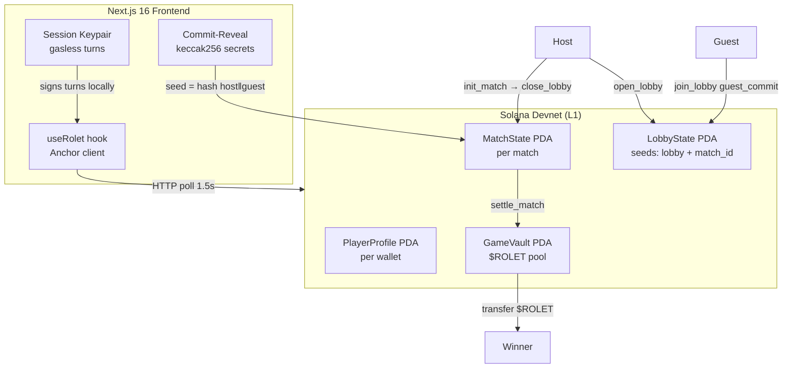

# ROLET


> A fully on-chain PvP Russian Roulette on Solana. Eight chambers, tactical
> cards, session-key gasless turns, real 2-player matchmaking via on-chain
> Lobby PDA. One winner claims `$ROLET`.

**Live demo:** [`rolet-web-server.vercel.app`](https://rolet-web-server.vercel.app) (Solana Devnet)  
**Program:** [`2ePEUzC...QPrS7`](https://explorer.solana.com/address/2ePEUzCFcxD559Hy3irB2TGbYAwU2UD352sVj77QPrS7?cluster=devnet) on devnet

---

## Screenshots

> _Add screenshots here after recording the demo._  
> Suggested: lobby screen · active duel · winner payout · profile page.

---

## What is it?

Two players share a revolver loaded with **5 live + 3 blank** rounds in 8 chambers. Each turn: play a card or pull the trigger. HP hits 0 → game over. Winner claims tokens from the on-chain vault.

Twelve tactical cards change everything: reveal the next chamber (HawkEye), eject it (BulletExtractor), deal double damage (DoubleStrike), shield the next shot (Blocker), and more.

All state lives on Solana L1. No server, no database.

---

## Key Features

1. **Global Auto-Matchmaking**: Fully on-chain global matchmaking pool without any central server. Players are seamlessly matched in real-time.
2. **SNS Identity (Bonfida)**: Player profiles verify their `.sol` domains upon registration.
3. **Session Keys (Gasless Gameplay)**: Players sign exactly ONE transaction to start the match. All subsequent moves (firing, using items) are auto-signed by a temporary session keypair.
4. **Commit-Reveal RNG**: Uses Solana slot hashes combined with blinded player entropy to guarantee unpredictable chamber contents.
5. **Tactical Item Cards**: Fully implemented on-chain logic for items like `Shuffler`, `HawkEye`, `LastChance`, and `HandOfFate`.

---

## Full game flow

```
Player A                                Player B
────────                                ────────
Connect wallet                          Connect wallet
↓                                       ↓
/profile → init_player_profile          /profile → init_player_profile
↓
/duel → CREATE LOBBY
  └─ open_lobby (Lobby PDA on-chain)
     └─ share link: /duel?join=<id>
                                        Open shared link
                                        └─ join_lobby (commits secret)
↓
"Guest joined" detected (polling)
└─ LAUNCH MATCH
   └─ init_match (commits host secret + seals RNG from both)
   └─ close_lobby (Lobby PDA cleaned up)
↓                                       ↓
ARM WEAPON                              ARM WEAPON
└─ register_session_key                 └─ register_session_key
   (1 popup, then gasless)
↓                                       ↓
Turn loop (popup-free via session key)
├─ pull_trigger / play_card
├─ HP damage, card effects
└─ next turn...
↓
settle_match → winner claims $ROLET
```

---

## Architecture



**Commit-reveal RNG:** Host and guest each generate a random secret off-chain, hash it (keccak256), and submit the hash on-chain. After both are committed, the match seeds its RNG from `hash(host_secret ‖ guest_secret)`. Neither player can manipulate the outcome.

**Session keys:** Registered on-chain via `register_session_key`. The session keypair signs turns locally, eliminating wallet popups for the entire session duration.

---

## On-chain instructions

| Instruction | Description |
|-------------|-------------|
| `init_player_profile` | Create player PDA (one-time enrollment) |
| `open_lobby` | Host creates LobbyState PDA with host_commit |
| `join_lobby` | Guest submits guest_commit + guest_secret |
| `init_match` | Host reveals, seeds RNG, closes lobby, creates MatchState |
| `register_session_key` | Store ephemeral pubkey + expiry on PlayerProfile |
| `pull_trigger` | Fire current chamber; apply HP damage |
| `play_card` | Activate one of 12 tactical cards |
| `settle_match` | Transfer $ROLET from vault to winner |
| `init_vault` | Bootstrap treasury PDA (one-time, admin) |

---

## Stack

| Layer | Tech |
|-------|------|
| Program | Anchor 0.30.1 · Rust · Solana Devnet |
| Frontend | Next.js 16 · React 19 · Tailwind v4 |
| Wallet | Phantom + Solflare via `@solana/wallet-adapter` |
| RPC | RPC Fast (devnet infrastructure) |
| Reward | `$ROLET` SPL token (6 decimals) |

---

## Quickstart (local dev)

**Prerequisites:** Rust, Solana CLI, Anchor 0.30.1, Node 20+, pnpm

```bash
# 1. Install
pnpm install

# 2. Build the program
cd apps/server
anchor build --no-idl        # --no-idl required (see HANDOFF §9)

# 3. Deploy to devnet (one-time)
solana program deploy target/deploy/rolet.so \
  --program-id target/deploy/rolet-keypair.json \
  --url https://api.devnet.solana.com

# 4. Bootstrap vault
RPC_URL=https://api.devnet.solana.com npx tsx scripts/bootstrap-vault.ts

# 5. Frontend
cd ../web
cp .env.example .env.local   # set NEXT_PUBLIC_RPC_ENDPOINT
pnpm dev
```

Open `http://localhost:3000`. Set wallet to **Devnet** (Phantom: Settings → Developer Settings → Custom RPC).

---

## Repo layout

```
rolet-web/
├── apps/
│   ├── server/
│   │   ├── programs/rolet/src/lib.rs   # ~1300 LOC Anchor program
│   │   └── scripts/bootstrap-vault.ts  # vault init (run once)
│   └── web/
│       ├── app/                        # routes: /, /duel, /profile
│       ├── hooks/useRolet.ts           # ~1000 LOC Anchor client + game logic
│       └── idl/rolet.json              # Anchor IDL
├── packages/shared/
├── HANDOFF.md                          # full architecture + gotchas
├── DEMO-SCRIPT.md                      # recording guide for demo video
├── PITCH.md                            # hackathon pitch deck content
└── ROADMAP.md                          # feature backlog
```

---

## Known limitations

- **Commit-Reveal Vulnerability**: In the current implementation, the `join_lobby` instruction requires the Guest to pass their `guest_secret` to the blockchain in plain text. This creates a griefing vector where the Host can read the Guest's secret, compute the final game seed locally, and choose not to call `init_match` if the initial gun chambers are unfavorable. For a production release, the flow will be split into a strict three-step commit-reveal (Guest commits hash -> Host calls init -> Guest reveals). Due to the hackathon deadline, this remains a known limitation.
- **MagicBlock ER not active.** SDK has a `solana-program` type-split conflict with Anchor 0.30.1. ER delegation is mathematically impossible to enforce solely from the frontend without the Rust `#[ephemeral]` bindings. The game runs flawlessly on L1 Devnet with Session Keys.
- **No Character NFT yet.** Profile stores a placeholder; Metaplex Core mint flow is on the roadmap.
- **Tests minimal.** `init_match` smoke test only.

---

## License

MIT
