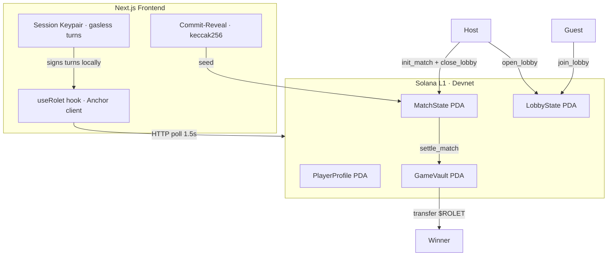

# ROLET

<p align="center">
  
  
  
  
</p>

<p align="center">
  <strong>Fully on-chain PvP Russian Roulette on Solana.</strong><br/>
  Eight chambers. Twelve tactical cards. One winner claims the vault.
</p>

<p align="center">
  <a href="https://rolet-web-server.vercel.app">Live Demo (Devnet)</a> ·
  <a href="https://explorer.solana.com/address/2ePEUzCFcxD559Hy3irB2TGbYAwU2UD352sVj77QPrS7?cluster=devnet">On-chain Program</a>
</p>

---

## What is it?

Two players share a revolver loaded with **5 live + 3 blank** rounds across 8 chambers. On each turn a player can either play a tactical card or pull the trigger. First to 0 HP loses. Winner claims tokens from the on-chain vault.

Twelve unique cards change everything — reveal the next chamber with **HawkEye**, eject it with **BulletExtractor**, shield the next shot with **Blocker**, deal double damage with **DoubleStrike**, and more.

All state lives on Solana. No server. No database.

---

## Key Features

| Feature | Description |
|---|---|
| **Global Auto-Matchmaking** | Fully on-chain lobby pool — players are matched in real-time without any central server |
| **Session Keys** | One wallet signature to start; all in-match turns are gasless via an ephemeral keypair |
| **Commit-Reveal RNG** | Host and guest blind their entropy on-chain; RNG seeds from `hash(host ‖ guest)` — neither side can manipulate the outcome |
| **SNS Identity** | Player profiles verify `.sol` domains via Bonfida SNS on registration |
| **12 Tactical Cards** | Fully on-chain card logic — HawkEye, Shuffler, LastChance, HandOfFate, and 8 more |
| **3D Arena** | React Three Fiber scene with GLB models, post-processing, and CRT aesthetic |

---

## Game Flow

```
Player A                              Player B
────────                              ────────
/profile → init_player_profile        /profile → init_player_profile
↓
/duel → FIND MATCH
  └─ scans for open lobbies
  └─ opens own lobby if none found
     (open_lobby → Lobby PDA on-chain)
                                       /duel → FIND MATCH
                                         └─ finds host lobby
                                         └─ join_lobby (commits secret)
↓
"Guest joined" detected (polling)
  └─ init_match: reveals host secret, seeds RNG, closes lobby
  └─ MatchState PDA created on-chain
↓                                     ↓
register_session_key                  register_session_key
(1 popup — then fully gasless)
↓                                     ↓
         Turn loop (popup-free)
         ├─ pull_trigger → HP damage
         ├─ play_card → card effect
         └─ next turn...
↓
settle_match → winner claims $ROLET from vault
```

---

## Architecture



---

## On-chain Instructions

| Instruction | Description |
|---|---|
| `init_player_profile` | Create player PDA (one-time enrollment) |
| `open_lobby` | Host creates LobbyState PDA with host_commit |
| `join_lobby` | Guest submits guest_commit + guest_secret |
| `init_match` | Host reveals, seeds RNG, closes lobby, creates MatchState |
| `register_session_key` | Store ephemeral pubkey + expiry on PlayerProfile |
| `pull_trigger` | Fire current chamber; apply HP damage |
| `play_card` | Activate one of 12 tactical cards |
| `settle_match` | Transfer $ROLET from vault to winner |

---

## Stack

| Layer | Tech |
|---|---|
| Program | Anchor 0.30.1 · Rust · Solana Devnet |
| Frontend | Next.js 16 · React 19 · Tailwind v4 |
| 3D | React Three Fiber v9 · drei · @react-three/postprocessing |
| Wallet | Phantom / Solflare via `@solana/wallet-adapter` |
| Identity | Bonfida SNS |
| Token | `$ROLET` SPL token (6 decimals) |

---

## Quickstart

**Prerequisites:** Rust, Solana CLI, Anchor 0.30.1, Node 20+, pnpm

```bash
# Install dependencies
pnpm install

# Run the frontend (devnet)
cd apps/web
cp .env.example .env.local   # set NEXT_PUBLIC_RPC_ENDPOINT
pnpm dev
```

Open `http://localhost:3001`. Set wallet network to **Devnet**.

### Deploy the program yourself (optional)

```bash
cd apps/server
anchor build
solana program deploy target/deploy/rolet.so \
  --url https://api.devnet.solana.com

# Bootstrap vault (one-time)
npx tsx scripts/bootstrap-vault.ts
```

---

## Repo Layout

```
rolet-web/
├── apps/
│   ├── server/
│   │   ├── programs/rolet/src/lib.rs   # Anchor program (~1300 LOC)
│   │   └── scripts/bootstrap-vault.ts
│   └── web/
│       ├── app/                        # Routes: /, /duel, /profile, /leaderboard
│       ├── components/                 # DuelArena3D, HandRack3D, Nav
│       ├── hooks/
│       │   ├── useRolet.ts             # Anchor client + full game logic
│       │   └── useSound.ts             # Sound effects + mute toggle
│       ├── public/
│       │   ├── models/                 # GLB assets (table, revolver, lantern, bullet)
│       │   └── sounds/                 # OGG sound effects
│       └── idl/rolet.json              # Anchor IDL
└── packages/shared/
```

---

## Known Limitations

- **Commit-Reveal griefing vector:** In the current implementation `join_lobby` passes `guest_secret` in plain text, allowing a malicious host to preview the RNG seed and decline to launch if unfavorable. A strict three-step commit → init → reveal flow closes this — planned post-hackathon.
- **MagicBlock ER not active:** The SDK has a type conflict with Anchor 0.30. The game runs fully on L1 devnet with session keys instead.
- **No Character NFT:** Profile holds a placeholder; Metaplex Core mint is on the roadmap.

---

## License

MIT
